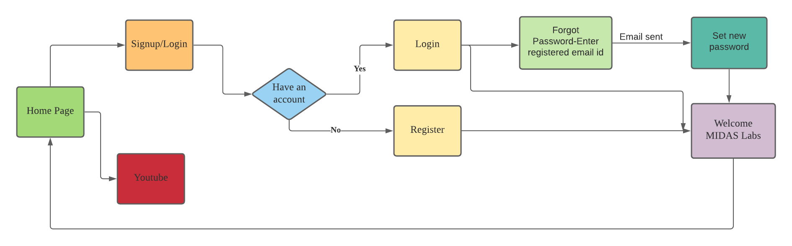

# MIDAS Web App

### INTRODUCTION

The MIDAS Web App contains a local authentication system implemented using passport.js to register/login to the website. It also has the forgot password functionality to reset user's passwords through a link sent to their registered email id. It showcases design as closely as possible to the proposed design with a particular creative element of mine.

### Link to the App :

https://fierce-forest-14898.herokuapp.com/

### Techonologies used for creating the App

#### Frontend : HTML,CSS,Javascript,Bootstrap
#### Backend  : Node.js, Express.js, passport.js, mongoDB

### Approach 

1. Home page contains the link to register/login to the website. It also includes a link to go to youtube if a user wants to explore the organization.
2. To register, it requires a username, password, and email-id to create an account for a user on the website.
3. To login, it requires the username and password of the registered user.
4. If the user forgot his/her password, the app also has a password reset functionality implemented to set a new password for the registered account.
5. Clicking on forgot password would lead to a form asking for the registered email address.
6. An email containing a link to reset the password will be sent to the registered email address. Users can set the new password using the link. The link expires after one hour.
5. After login user is taken to a custom-made page of MIDAS lab.
6. Users can log out using the logout button on the MIDAS lab and be redirected to the home page.
7. App also flashes messages in case of errors and successful registering, email sent, and logged out, making a statement for the user to be aware of the functions completed in the website's backend.

### Flowchart 

  

